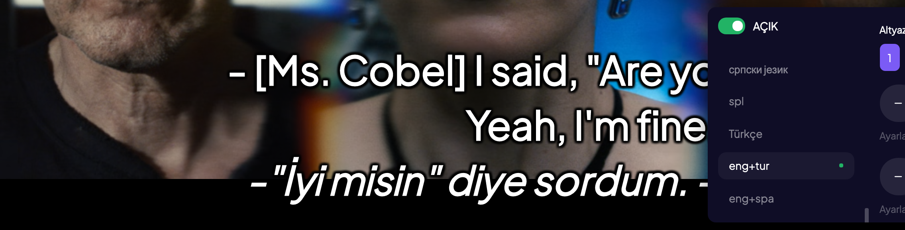

# Dual Subtitles for Stremio

A Stremio addon that displays **two subtitle languages simultaneously** - designed for language learners who want to watch movies and TV series with bilingual subtitles.

[](https://stremio-dual-subtitles.vercel.app)
[](LICENSE)
[](https://nodejs.org/)

---

## Demo



*Primary language on top, secondary language below in italics.*

---

## Features

| Feature | Description |
|---------|-------------|
| **Dual Display** | Two languages shown simultaneously - primary on top, translation below |
| **70+ Languages** | Full OpenSubtitles language support |
| **Smart Sync** | Time-based subtitle merging algorithm |
| **Encoding Support** | UTF-8, UTF-16, Windows codepages, ISO-8859 variants |
| **No Registration** | Works instantly, no API keys required |
| **Privacy First** | No personal data collection |

---

## Quick Start

### Public Instance (Recommended)

1. Visit [stremio-dual-subtitles.vercel.app](https://stremio-dual-subtitles.vercel.app)
2. Select your primary language (learning) and secondary language (native)
3. Click "Install to Stremio"
4. Open any movie or series and select the dual subtitle option

### Self-Hosted

```bash
# Clone repository
git clone https://github.com/ummugulsunn/stremio-dual-subtitles.git
cd stremio-dual-subtitles

# Install dependencies
npm install

# Start server
npm start
```

Server runs at `http://localhost:7000/configure`

### Deploy to Vercel

[](https://vercel.com/new/clone?repository-url=https://github.com/ummugulsunn/stremio-dual-subtitles)

---

## Configuration

### Environment Variables

| Variable | Default | Description |
|----------|---------|-------------|
| `PORT` | `7000` | Server port |
| `HOST` | `0.0.0.0` | Host binding |
| `EXTERNAL_URL` | auto | External URL for remote access |
| `ANALYTICS_SECRET` | - | Secret key for `/stats` access |
| `DEBUG_MODE` | `false` | Enable debug logging |

Copy `.env.example` to `.env` and modify as needed.

### Network Access

For use on other devices:

1. Find your local IP (e.g., `192.168.1.100`)
2. Set `EXTERNAL_URL=http://192.168.1.100:7000`
3. Access from other devices using the IP address

---

## Project Structure

```
stremio-dual-subtitles/
├── addon.js            # Subtitle fetching and merging logic
├── server.js           # Express server, routing, API endpoints
├── encoding.js         # Character encoding detection
├── languages.js        # Language mappings and utilities
├── landingTemplate.js  # Landing page template
├── lib/
│   ├── analytics.js    # Usage tracking
│   ├── debug.js        # Logging utilities
│   └── templates.js    # HTML templates
├── public/
│   ├── logo.png        # Addon logo
│   └── demo.png        # Demo screenshot
├── vercel.json         # Vercel configuration
└── package.json        # Dependencies
```

---

## Technical Details

### Subtitle Processing

1. Fetches subtitles from OpenSubtitles via Stremio's proxy API
2. Decodes with automatic encoding detection
3. Parses SRT format and extracts timing data
4. Merges based on timestamp overlap
5. Outputs combined SRT with primary + secondary lines

### Supported Encodings

- UTF-8, UTF-16 LE/BE (with BOM detection)
- Windows codepages (1250-1258)
- ISO-8859 variants (1-15)
- Double-encoded UTF-8

### API Endpoints

| Endpoint | Description |
|----------|-------------|
| `/configure` | Landing page |
| `/manifest.json` | Addon manifest |
| `/:config/manifest.json` | Configured manifest |
| `/:config/subtitles/:type/:id.json` | Subtitle list |
| `/subs/:params.srt` | Subtitle file |
| `/health` | Health check |
| `/stats` | Analytics (requires key) |
| `/robots.txt` | SEO robots file |
| `/sitemap.xml` | SEO sitemap |

---

## Usage Tips

**For effective language learning:**

- Set the language you're learning as PRIMARY (top position)
- Read the primary subtitle first, then check the translation
- TV series work well due to consistent vocabulary
- Animated content often has clearer pronunciation

---

## Troubleshooting

**Subtitles not appearing?**
- Verify both languages have subtitles available for that content
- Try different content - not all movies have all languages
- Clear Stremio cache and reinstall the addon

**Encoding issues?**
- The addon auto-detects encoding for most files
- Report problematic content with the title for investigation

**Network issues?**
- Check firewall settings for port 7000
- Ensure `EXTERNAL_URL` matches your network configuration

---

## Contributing

1. Fork the repository
2. Create a feature branch (`git checkout -b feature/name`)
3. Commit changes (`git commit -m 'Add feature'`)
4. Push to branch (`git push origin feature/name`)
5. Open a Pull Request

---

## License

MIT License - see [LICENSE](LICENSE) for details.

---

## Credits

- Subtitles provided by [OpenSubtitles](https://www.opensubtitles.org/)
- Built with [Stremio Addon SDK](https://github.com/Stremio/stremio-addon-sdk)
- Inspired by [Strelingo Addon](https://github.com/Serkali-sudo/strelingo-addon)
